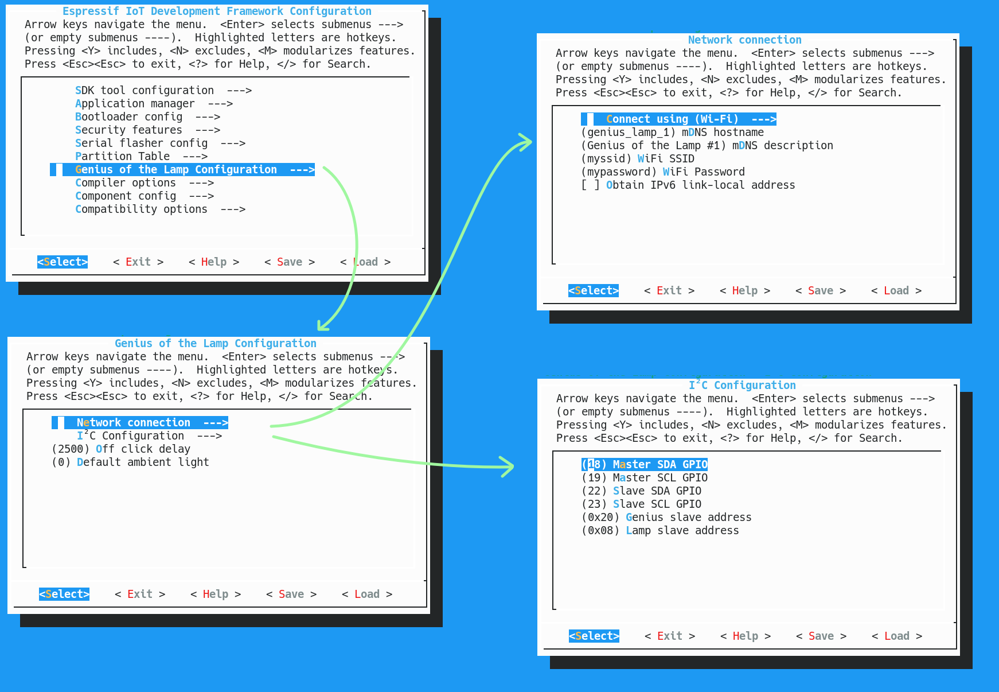

# GeniESP32-of-the-Lamp

This project emulates a Lamp i²c controller, using ESP32 boards and [esp-idf](https://docs.espressif.com/projects/esp-idf/en/latest/esp32/index.html) based software.

NOTE : the `sources/` sub directory is the ESP-IDF project. You won't be able to run the build command `esp.py` outside its boundaries.

## Getting the toolchain and starting the environment

Just follow steps 1..4 of the very well written [Get Started Guide](https://docs.espressif.com/projects/esp-idf/en/latest/esp32/get-started/index.html) on Espressif's website. 

**HINT**: some files are installed in `$HOME/.espressif/`, they maybe useful for various stuff, mainly some sourcable script like `. ~/.espressif/python_env/idf4.0_py3.8_env/bin/activate` that starts a python's virtualenv, which is ideal to install required python dependencies instead than on your root system's `site-packages` (the, more or less, default `$PYTHON_PATH`)

Just source : 

1. the virtualenv script in `$HOME/.espressif/`
2. the export.sh file in you ESP-IDF install

and then run `idf.py`. It will be very informative about missing / mismatching dependencies.

## project configuration

## retro-engineering the i²c protocol 

On the first stage of the project, the need was to analyse the protocol used by the provided module and the Lamp.

The `retro/` folder containts useful scripts to analyse i²c frames / dialogs. 
Logs are captured and dumped using Pulseview protocol decoders, then converted/analyzed by those tools.

Quick demo :

### "Historical" note

At the beginning, the `parse_i2c_logs.py` tool was aimed to analyse various input file format (not only "Jon") 
and I tried to design the parsing part to be extensible... 

I never really used this tool on the logs captured by Aymeric (in a slight different format), and, 
it turn out my "generic" design was a real PITA to adapt to the sigrok output format, even if being a CSV format.
So I just wrote a third party converter from sigrok / pulseview to Jon format.
